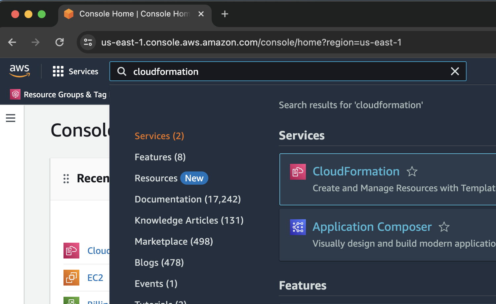
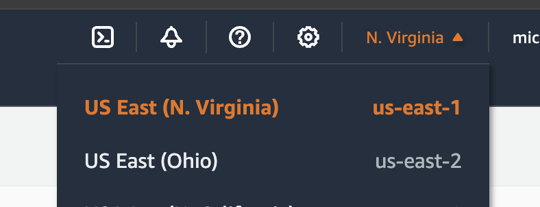
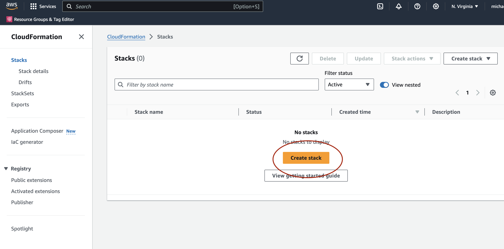
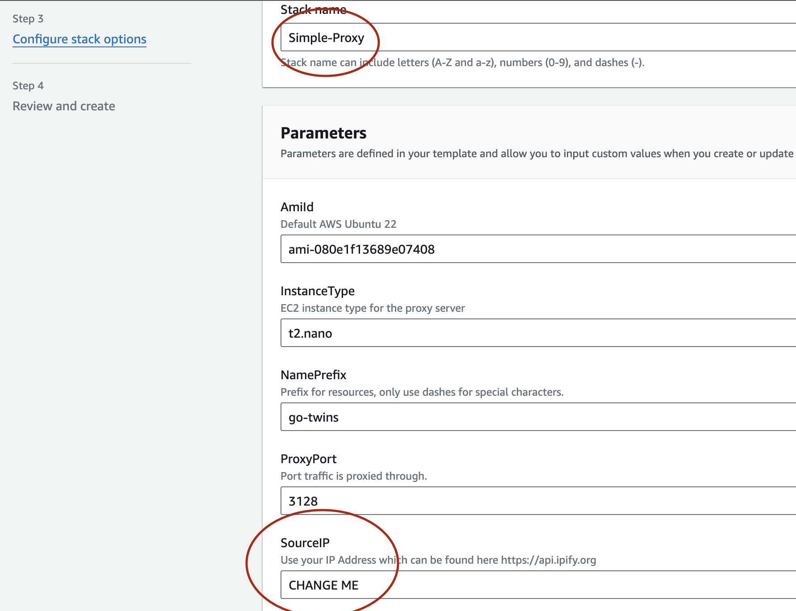
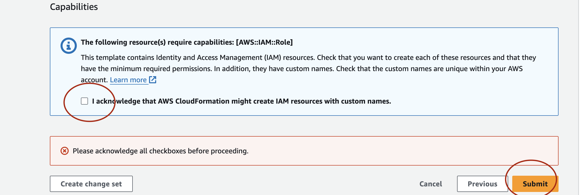
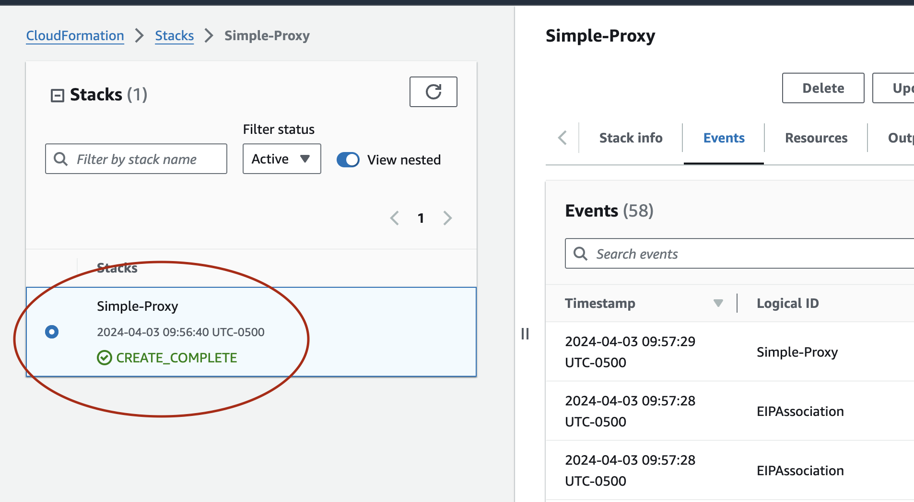
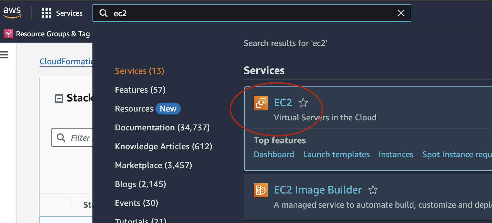
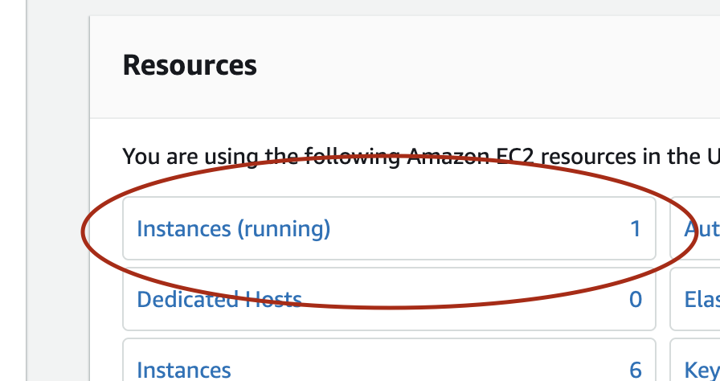
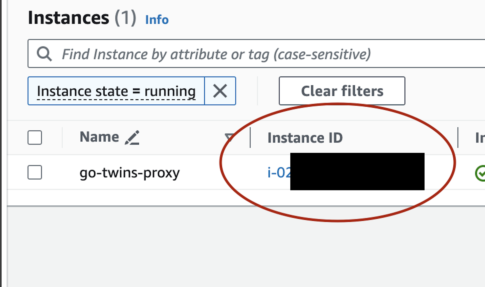
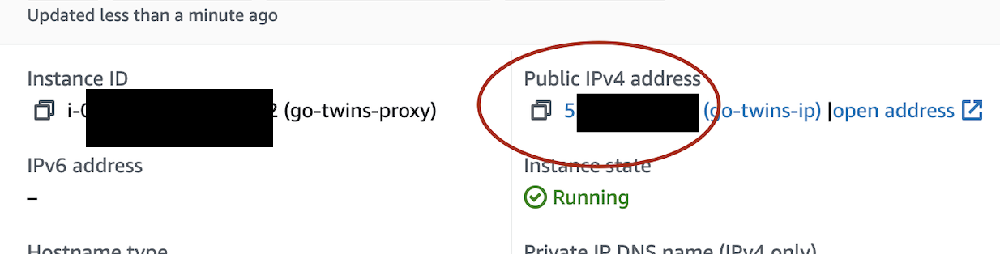

# Instructions for Setting Up Your Personal Proxy

Please note! The monthly cost of running this proxy is ~$6-$10 depending on whether the stop/start automation is enabled. The proxy is running on the cheapest available server type and can be enabled to automatically shut down from 11pm-11am CST (or whatever time you set it to) daily to save on cost.

Important! Proxy Server that is created is only accessible from your IP address. If you change Wi-Fi you will not be able to access.

## Prerequisites
1. An internet Browser (Chrome, Firefox, Safari, Etc.)
2. Sign up for AWS: [AWS Signup](https://portal.aws.amazon.com/gp/aws/developer/registration/index.html?refid=em_127222)
3. 5-10 minutes to follow these instructions.

## Steps

1. **Go to the CloudFormation service in the AWS Console**
   - From the AWS Console home page, click on the "CloudFormation" service under the "Services" menu.  

     

   - Make sure to check that you are in the us-east-1 region in the upper right-hand corner.  

     

2. **Create a new stack**
   - On the CloudFormation Stacks page, click the "Create stack" button in the upper right to start creating a new stack.  

     

3. **Upload the simple-proxy.yaml file**
   - On the "Create stack" page, under "Prerequisite - Prepare template", select the "Upload a template file" option.
   - Click the "Choose file" button and upload the simple-proxy.yaml file found in this repo.

     

4. **Change your IP**
   - Choose a stack name (no special characters or spaces).
   - **Very important, change the SourceIP parameter. This value will be your IP that you are trying to mask. You can find the value at https://api.ipify.org.**  

     

5. **Check acknowledge box and click Submit**  

     

6. **Wait for CloudFormation Stack to create**
   - This should take 1-2 minutes.  

     

7. **Navigate to the EC2 page**  

     

8. **Click on Instances**  

     

9. **Click on your newly created instance (aka your proxy server)**  

     

10. **Take note of the public IP address**
    - This is the IP you will use to configure the proxy on your computer/iPhone/tablet.  

      

Remember, the most critical step is to **change the SourceIP parameter to your actual IP address** that you want to mask. You can find your IP address at https://api.ipify.org.

## Using Your Proxy

### iPhone/iPad

1. Use Manual Proxy, enter in your Public IP from Step 10 as the "Server".
2. Port will be 3128.
3. Follow the detailed instructions here: [How to Set Up a Proxy for iPhone](https://smartproxy.com/configuration/how-to-setup-proxy-for-iphone)

### Mac

1. Toggle "Web proxy (HTTP)" and "Secure web proxy (HTTPS)" and enter in your Public IP from Step 10 as the "Server".
2. Port will be 3128.
3. Refer to the official guide: [Change proxy settings on Mac](https://support.apple.com/guide/mac-help/change-proxy-settings-on-mac-mchlp2591/mac#:~:text=Learn%20how%20to%20enter%20proxy,may%20need%20to%20scroll%20down.)&text=Configure%20proxy%20server%20settings%20automatically.)

### Windows

1. Follow the step-by-step guide: [Use a proxy server in Windows](https://support.microsoft.com/en-us/windows/use-a-proxy-server-in-windows-03096c53-0554-4ffe-b6ab-8b1deee8dae1#:~:text=server%20connection%20manually-,Select%20the%20Start%20button%2C%20then%20select%20Settings%20%3E%20Network%20%26%20Internet,optional)%20in%20the%20respective%20boxes.)
2. Enter your Public IP from Step 10 as the "Address" and 3128 as the "Port".

## Deleting the Proxy

To delete the proxy, search for Cloudformation in your AWS console. Select the Cloudformation stack you created and click "Delete".